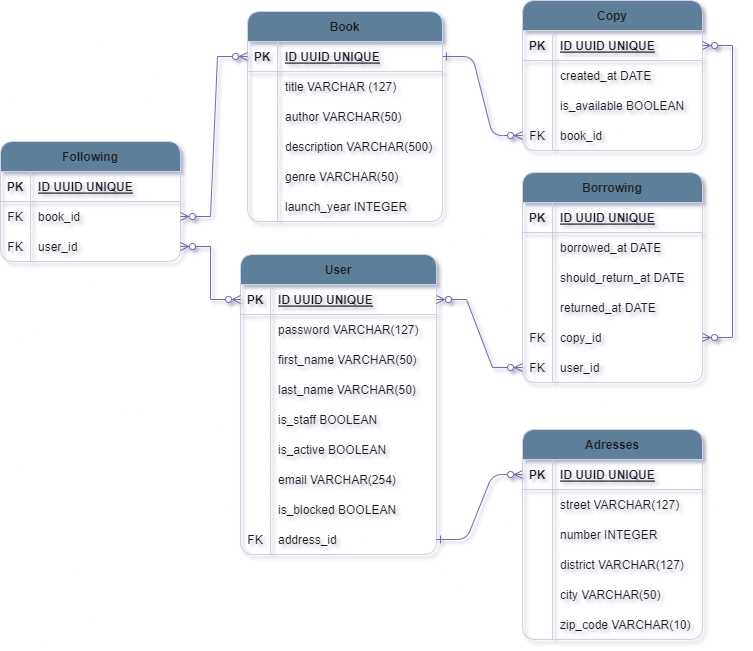

<h1>Welcome to <strong>Last Chapter!<strong></h1>

This application aims to manage a library in which students can pick up books with a return date and, if they do not return, they must be blocked.

<h3>Diagram:</h3>



<h2>Installation</h2>

Install and activate venv

```bash
  pip install venv
```
Activate on

- Linux: `source venv/bin/activate`
- Windows: `.\venv\Scripts\activate`
- Gitbash: `source venv/Scripts/activate`

Install all dependencies:
```bash
  pip install -r requirements.txt
```
Run the migrations:
```bash
python manage.py migrate
```

## Devs who were part of this project:

- [Angelica Assini](https://www.linkedin.com/in/angelica-assini/)
- [Dreic Leal](https://www.linkedin.com/in/dreicleal/)
- [Henrique Jesus](https://www.linkedin.com/in/henrique-jesus128/)
- [Yasmin Batista](https://www.linkedin.com/in/tsukedev/)
